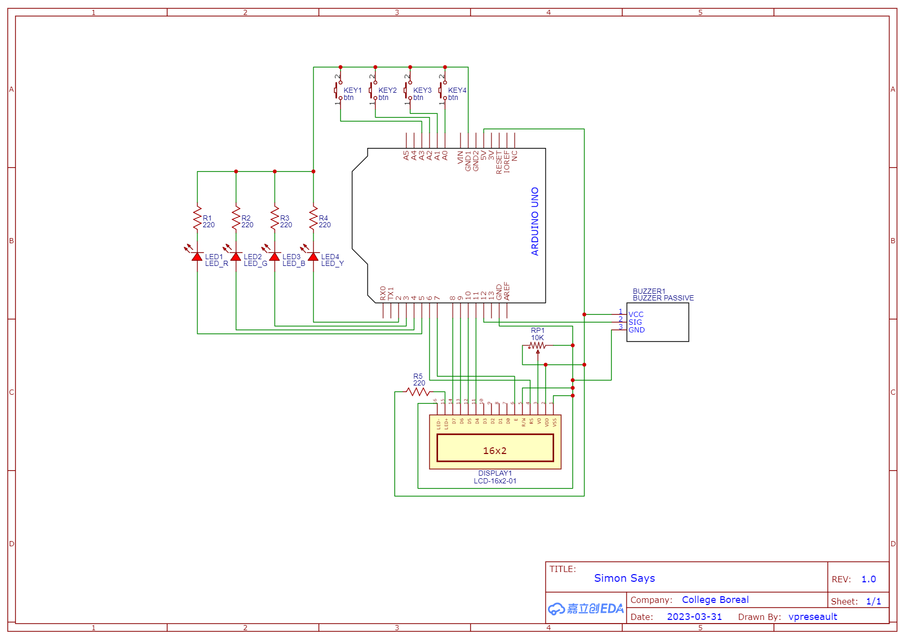
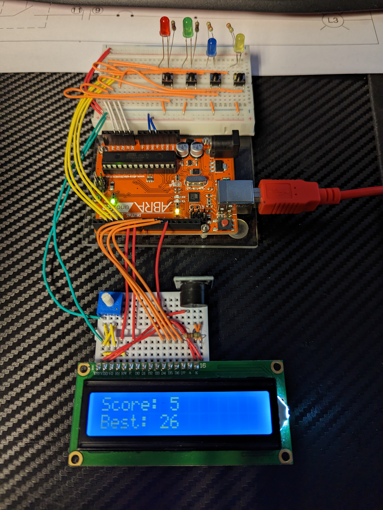

# Simon Says

## Project Description

This was created as a final project for the Electronics II (ELN1037) class at Collège Boréal. It is an arduino based simon says game.

## Game Description

Simon Says is an game of short-term memory skill. The computer creates a sequence of tones and lights and requires a user to repeat the sequence. If the user succeeds, the length of the sequence increases by one and becomes progressively more complex as a result. Once the user fails to repeat the sequence correctly, the score and sequence length resets and the game restarts.

## Schematic

## Parts

- Arduino Uno​
- Bread board​
- LED​s
- Resistors ($220\ohm \times 5$)​
- Push button​s
- Passive buzzer module​
- LCD​
- Potentiometer (10k Ω)​

## Finished Product

